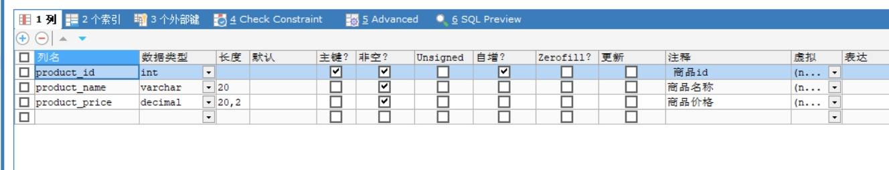
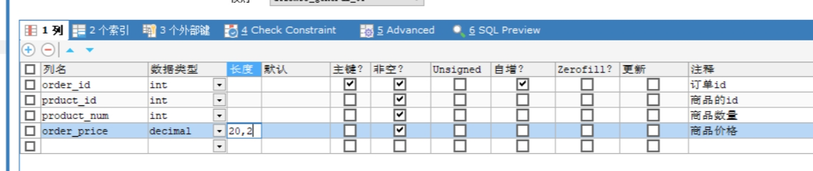

# 项目的介绍以及遇到的一些问题

## 简单介绍

之前的修改记录被我删除了（写的太烂了）

以下是最新的介绍


**使用spring，mybatis框架**

### 数据库的表

1. 商品表(用sqlyog偷懒创建的)

   

2. 订单表（同上）

   

3. 商品订单关联表

   用于将订单和商品联系起来的表

   ```sql
   CREATE TABLE `orderproduct`(
   `order_id` INT(20) NOT NULL COMMENT '订单的id',
   `product_id` INT(20) NOT NULL COMMENT '商品的id',
   `quantity` INT(20) NOT NULL COMMENT '商品的数量',
   PRIMARY KEY (`order_id`, `product_id`),
   FOREIGN KEY (`order_id`) REFERENCES `order`(order_id) ON DELETE CASCADE,
   FOREIGN KEY (product_id) REFERENCES `product`(product_id) ON DELETE CASCADE
   ) ENGINE=INNODB DEFAULT CHARSET=utf8;
   ```


### 实体类

order

```JAVA
private int orderId;
private BigDecimal orderPrice;
private Date createTime;
private Date updateTime;
```

orderproduct

```JAVA
private int orderId;
private int productId;
private int quantity;
private Date createTime;
private Date updateTime;
```

product

```java
private int productId;
private String productName;
private BigDecimal productPrice;
private Date createTime;
private Date updateTime;
```

### dao层

对实体类的增删改查，具体代码参考项目

### service

同上


## 遇到的问题与待改进点

异常类还未创建，主要这玩意不知道要写哪些。。。。

遇到的问题

* 我的关联表是又order_id product_id 俩个外键，但是我想在创建关联表的同时创建订单表并使用sum函数自动计算总价，但是这样就会因为外键的约束而报错，我不知道应该怎么设计sql语句和事务的管理，我只好采用先创建一个空行，在创建一个关联行，在对原来的行进行更新。但是这样看好像显得繁琐


