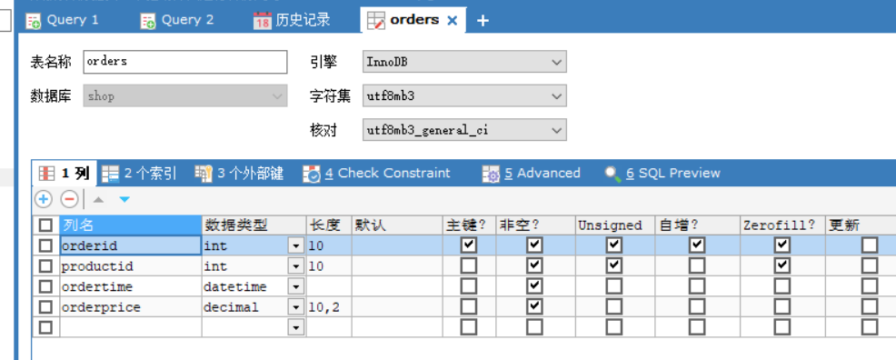
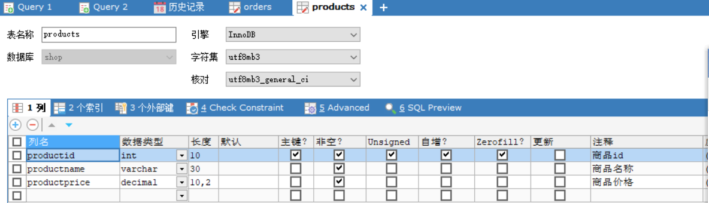

# 项目的介绍以及遇到的一些问题

## 简单介绍

* 该项目的数据库是采用MySQL8.0，通过jdbc连接
* 其中创建的表是通过sqlyog可视化创建的

* （新增10.12） shop文件夹是第二次修改（学完maven后的小成果，详细见下面标题）

​	 以下是该shop数据库的表的一些设置（sqlyog）





然后是jdbc的代码，我已经放在我的utils文件夹中了，以为当初一开始创建时我想用utils写一堆类的方法，后面给忘了，就全写一起了...

**Tools类：**

包括对orders和products的增删改查和驱动的加载和数据库的连接

**Test类：**

用于测试tools类的方法

**db1配置文件**:

```properties
driver=com.mysql.cj.jdbc.Driver
url=jdbc:mysql://localhost:3306/shop?useUnicode=true&characterEncoding=utf8&useSSL=true
username=root
password=1234567
```

这玩意没学过，纯抄狂神的步骤

==我能感觉出来自己写的不是很好.....，项目的亮点就是没有亮点==

**项目启动：**

我感觉这个项目的代码量也谈不上什么启动把，就test里一些语句来启动罢了，还望前辈们给点建议

---


## 一些问题及待改进点

* 最大的问题就是我是从idea里复制过来的代码和配置文件，里面的一些package语句和那个配置文件可能不能用，这个问题我不知道怎么避免，希望前辈的见谅
* 首先就是这个什么properties配置文件和那个什么class.forNAME，我之前好像是没学的，然后就完全照搬狂神的视频来的，还没去了解

* ```java
      //配置并加载驱动
      static {
          try {
              InputStream in = jdbcUtils.class.getClassLoader().getResourceAsStream("db1.properties");
              Properties properties = new Properties();
              properties.load(in);
              driver = properties.getProperty("driver");
              url = properties.getProperty("url");
              username = properties.getProperty("username");
              password = properties.getProperty("password");
  
              Class.forName(driver);
          } catch (Exception e) {
              throw new RuntimeException(e);
          }
  
      }
  ```

* 还有就是代码太繁琐，感觉orders和products的方法能合并一下或者啥的

* 其中的查询方法我觉得也可以改进就是不只是查一行而是可以很多行这样的

* 还有就是有关上面讲的项目启动

---

## 第二次修改（学了点maven）

把项目用maven框架来配置（其实就是把源代码CV到maven的工程里再改了一点），但是依赖的包太少了（其实没有），就不是很能复习maven的知识，而且感觉maven也是没学透，希望学长学姐能给点建议。

---

## 第三次修改（增加异常类并且修改了一些代码，然后把第二次的删除了，文件夹名Shop-Project）

加了异常类作为单独的一个项目，然后把一些

---


## **心得**

感觉只学了皮毛，就是感觉如果只有这样jdbc的话还不如直接写sql语句，还是继续塔塔开把！！！